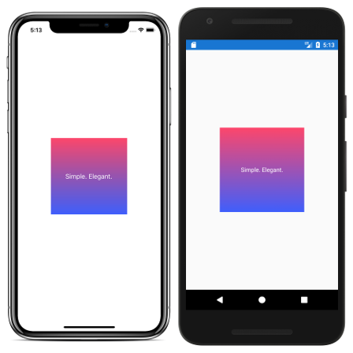

# GradientBoxView

An empowered Xamarin.Forms' BoxView with 2-color gradients.



(Inspired on [this Xamarin Forums thread](https://forums.xamarin.com/discussion/comment/240777/#Comment_240777).)

## How to use it

Just three easy steps:

1. Add [DevsDNA.GradientBoxView](https://www.nuget.org/packages/DevsDNA.GradientBoxView) NuGet to both your PCL and platform projects;

2. In your XAML file, add the following namespace –usually at the `ContentPage` root element:

```xaml
xmlns:devsdna="clr-namespace:DevsDNA;assembly=DevsDNA.GradientBoxView"
```

3. Place beautiful gradients there where you want!

```xaml
<devsdna:GradientBoxView
    TopColor="White"
    BottomColor="Black" />
```

*Pst!* Have a look to the [Examples](Examples/) folder to get some inspiration!
